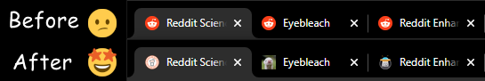

# Subreddit tab icons

This userscript replaces tab icons (favicons) on reddit.com with icons of
subreddits. Works both on new.reddit.com and old.reddit.com. It helps
distinguishing tabs of different subreddits from each other. Note, that not all
subreddits on Reddit have a separate icon.

The source code is distributed under the terms of the MIT Licence.  See
[LICENSE.txt](LICENSE.txt) for details.

## How to install

1. To install this userscript in your browser you'll need a browser extension
   for managing userscripts:

   - I recommend [https://www.tampermonkey.net/](https://www.tampermonkey.net/).
   - More options are listed on <https://greasyfork.org/> (section "Step 1:
     install a userscript manager")

2. Once you have a browser extension for userscripts installed, just click on
   the link and the extension will automagically detect it as a userscript:

   https://github.com/rybak/subreddit-tab-icons/raw/main/subreddit-tab-icons.user.js

You can also install the script from [Greasy Fork][greasyfork].

[greasyfork]: https://greasyfork.org/en/scripts/460086-subreddit-tab-icons "Install via Greasy Fork"
